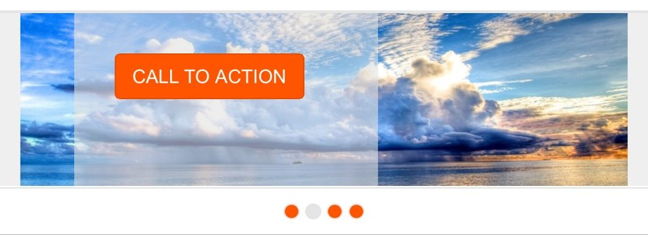
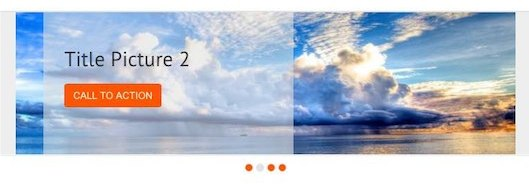
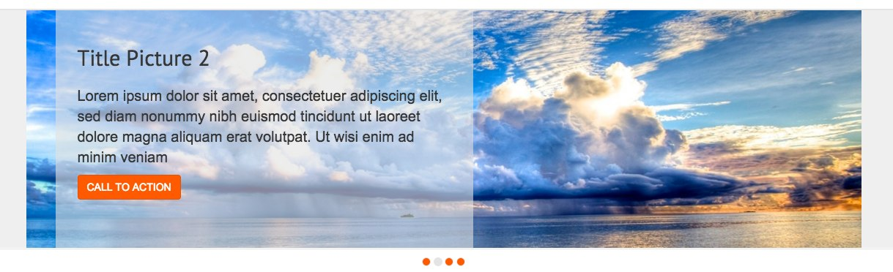
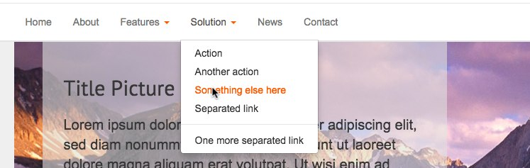
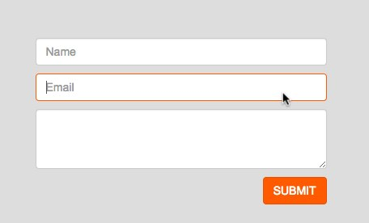

# Pixelant Layout#

In this layout I put together a couple of tecnologies to show how I use TwitterBootstrap and some other developement strategies to get the project done.

My primary objective is to show the way I tackle the task.

## Technologies Stack:

* HTML5
* CSS3
* TwitterBootstrap
* jQuery
* LessCSS
* GoogleFonts
* font icons
* GitHub

## Why do I use Git / GitHub?

I use GitHub for two reasons:

1. I split my work into task before to start coding
2. I keep trace of my activities by linkng my commits to tasks and branches so the project is open to collaboration

I've started by writing a list of tasks in order to have the overall control of the project. Whenever I find a bug, or something that I can improve, I create a new issue so I don't forget.

This way every commit is a little step forward and I can work more efficiently. Task after task.

I've also created a custom label "wip" that I use to pinpint my current task. It's very useful when you work in a team but also as reminder for myself in the morning.

I've tried to implement GitFlow to organise my job. I've produced a new feature branch for each task and I've used GitHub to create pull requests to the develop branch. 

## Important elements

I try to describe here some technical decision that I made.

* Top Menu Icon

With Bootstrap you can use the Glyphicons. For this layout I used a set on custom icon that I implemented with "Font Face" on the custom.css

<pre><code>
@font-face {
  font-family: 'icons';      
  src: url('../icons/fonts/icons.eot');
  src: url('../icons/fonts/icons.eot?#iefix') format('embedded-opentype'), 
  url('../icons/fonts/icons.woff') format('woff'), 
  url('../icons/fonts/icons.ttf') format('truetype'), 
  url('../icons/fonts/icons.svg#glyphicons_halflingsregular') format('svg');
}

</code></pre>

In order to have one single css file I imported on it also the style.css file.

* Slide show: 

I created a slideshow with an over background transparent with three contents. I decide to use a bootstrap class to hide some element on small and extra small device.

On small device will be visible only the button (like "BUY NOW")

On medium will be visible only the title and the button

On mediuam and large will be visible all the three elements

* Control Slideshow

The slideshow don't show a "next" or "prev" icon in the slideshow frame.
Thanks to the rounded points the user can know how many slides exist and what slide are active. He can also switch slide making a click on one rounded point.

  1. Gray when the slide is active
  
  2. Orange for the other slide that are not active now
  
  
* Dropdown Menu

I choose to change the color background for the link hover. The new background and the link color were modified in the variable.less file (bootstrap folder).

* Rouded images

I created the rounded images with a border radius background orange.
After that, I positioned a font-icon in the center of the circle.

* Social Icon

I decided to create it as in-line list of clickable icons.

* Form
Screen readers will have problem if you create a form without label. For this reason I used for each label the .sr-only class. In this way the label will be not visible for the user but only in the code.

I also change the color shadow (visible when is active) in the variables.less file.

* Google fonts

Google provide a lot of different fonts for web project. I choose to use it for titles.

I import the font in the custom.css file:
 
<pre><code>@import url(http://fonts.googleapis.com/css?family=PT+Sans:400,700);
</code></pre>

and wrote the css rule:

<pre><code>h1, h2, h3, h4 {
    font-family: 'PT Sans', sans-serif;
}
</code></pre>

* Contact 

For the section "CONTACT US" I used the tag address as Bootstrap suggest. 

* Optimization

I decided to try the Source code and take a look about what type of optimization I can do with that.
On the Gruntfile.js I "commented" all the file that I didn't need.
I also changed some attributes in to the variables.less (as wrote before).

## What I can do for emprove?

I hope to have a possibility to discuss this work with a senior developer. As Junior Developer I need suggestion in order to resolve some problems and improve my tecnique.

A part that i'm really interest is create less file and import that in the bootstrap.less file.
The optimization is very important.

I hope to receive some pullrequest or email in order to learn together.

  

 

